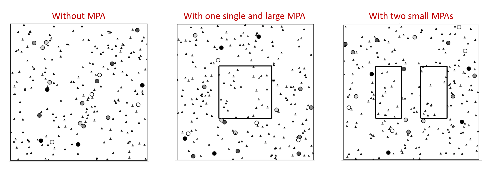
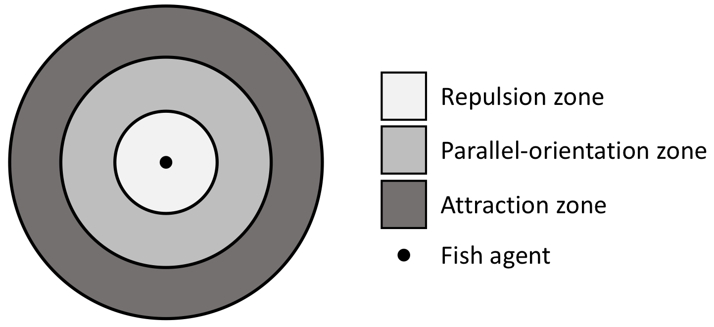
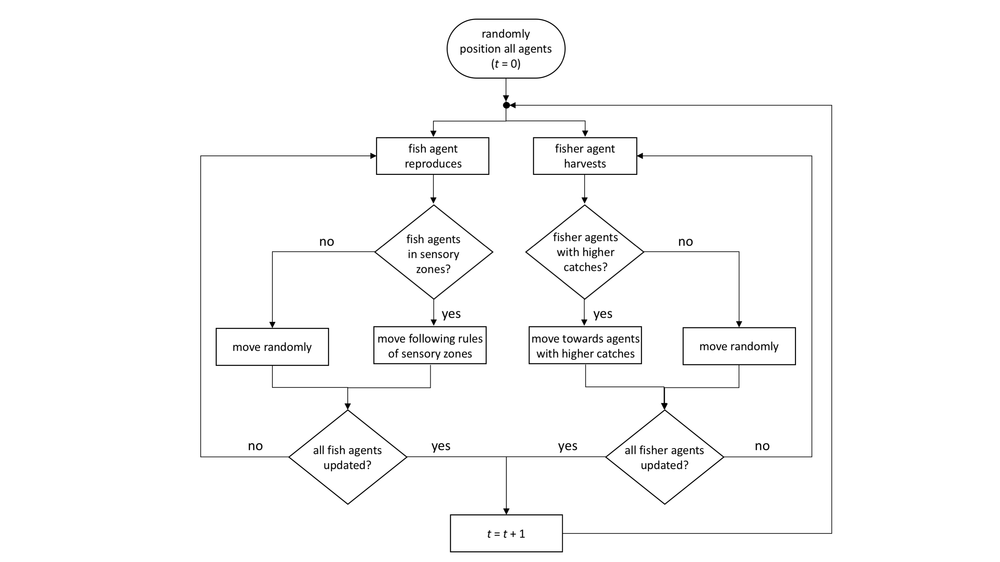

# Agent-Based Model to investigate the effects of human cooperation and Marine Protected Areas on a small-scale fishery

# General aspects
An Agent-Based Model (ABM) that captures the main characteristics of an idealised small-scale, artisanal fishery. The model can be used to disentangle the combined effects of fishing behaviour (expressed by a cooperative trait associated to fishing effort), and different designs of no-take fishery areas (presence or absence, age, size, distance between two MPAs) on fish abundances and catches.

The model comprises two types of agents, the fishing agents (pirogues) and fish agents (schooling fish). Agents are initially randomly distributed on a finite two-dimensional space representing the fishing ground. Fishing agents (represented by dots) are distinguished by different tonalities of grey, reflecting their associated cooperative trait value, ranging from fully-cooperative (black) to fully non-cooperative (lightest gray). Fish agents (represented by triangles) are assumed identical.

<p align="center">
  
</p>

The reproduction of fish agents is simulated as a stochastic process depending on a reproduction probability and on a logistic-type growth restriction. The movement of fish agents is simulated using three sensory zones around the fish, namely, repulsion zone, parallel-orientation zone, and attraction zone. 

<p align="center">
  
</p>

The harvest rate *H* of a fishing agent is described according to the classic Schaefer’s model (e.g. Clark, 2010 Mathematical bioeconomics. 3rd ed. John Wiley & Sons):

*H(n') = q E<sub>k</sub> n'*

Where *q* is the catchability coefficient, *n'* is the number of fish agents in a fixed neighbourhood, and *E<sub>k</sub>* is the fishing effort, ranging from 0.2 (lowest effort) to 1.0 (highest effort) and associated to a specific cooperative trait value.

# Technicalities

The file `CoopFishABM.py` contains the model code (in python) and is the script to run. The run generates (1) an subfolder named `/simulation_output`, which contains a video of the simulation (`simulation_video.mp4`), showing agents moving on the two-dimensional fishing ground and, if present, the MPA(s), (2) the data on the dynamics of fish abundance and catch (`simulation_data.csv`), and (3) snapshots of each computing time step of the simulation. 

#  Flow diagram

Below we show a flow diagram illustrating the events handled by the agent-based model over a single time step. The oval, diamonds, and rectangles mark, respectively, the initialisation, the decision, and the action occurring during the simulations. The arrow shows the direction of the events.



The state of our system (number of fishes and pirogues) is updated in an asynchronous manner (Cornforth et al. 2005; Caron-Lormier et al. 2008), we thus assume that in each asynchronous updating, $1/(n+P)$ of a time step passes by, where $n+P$ is the total number of agents (fishes and pirogues) at the time of updating. With this method, each agent (whether fish or pirogue) is updated once, on average, in each time step. 

D. Cornforth, D. G. Green, and D. Newth. Ordered asynchronous processes in multi-agent systems. *Physica D: Nonlinear Phenomena*, **204**(1-2):70–82, 2005.

G. Caron-Lormier, R. W. Humphry, D. A. Bohan, C. Hawes, and P. Thorbek. Asynchronous and synchronous updating in individual-based models. *Ecological Modelling*, **212**(3-4):522–527, 2008.


#  Setting relevant model parameters

* Parameters for the configuration of the MPA (presence/absence, size, age, and distance of between two MPAs).

     ```python
     MPA = 'yes'         # Presence or absence of MPA ('yes' for presence, 'no' for absence)
     Both = 'no'         # Presence of MPA ('no' for full-time presence, 'yes' for part-time presence)
     Time_MPA = 50       # Period of time over which MPA is active (when Both = 'yes') 
     Type_MPA = 'single' # Spacial configuration of MPA ('spaced' for 2 MPAs, 'single' for 1 MPA)
     Dist_MPA = 0.2      # Distance between two MPAs (when Type_MPA = 'spaced')
     Frac_MPA = 0.25     # Fraction of fishing grounde covered by MPA(s)
     ```

* Parameters for the configuration of different cooperative scenarios. Each fishing agent is characterised by one of five possible cooperation attributes (ranging from fully non-cooperative to fully cooperative). The sum of all cooperation types should be equal to the total number of fishing agents (`num_fishers`). 

* Thew case of Low Cooperation (LC) can be created as follows: 

     ```python
     fully_noncoop = 6     # number of fully non-cooperative pirogues
     noncoop = 5           # number of non-cooperative pirogues
     cond_coop = 4         # number of conditional cooperative pirogues
     coop = 3              # number of cooperative pirogues
     fully_coop = 2        # number of fully cooperative pirogues
     ```
     
* Thew case of Intermediate Cooperation (IC) can be created as follows: 

     ```python
     fully_noncoop = 4     # number of fully non-cooperative pirogues
     noncoop = 4           # number of non-cooperative pirogues
     cond_coop = 4         # number of conditional cooperative pirogues
     coop = 4              # number of cooperative pirogues
     fully_coop = 4        # number of fully cooperative pirogues
     ```

* Thew case of High Cooperation (HC) can be created as follows:  

     ```python
     fully_noncoop = 2     # number of fully non-cooperative pirogues
     noncoop = 3           # number of non-cooperative pirogues
     cond_coop = 4         # number of conditional cooperative pirogues
     coop = 5              # number of cooperative pirogues
     fully_coop = 6        # number of fully cooperative pirogues
     ```

     
#  Things to note

* How does a simulation with MPA of a given configuration (size, age, or/ and distance between two MPAs) compares with same simulation without MPA  in terms of fish abundance and catch?
* Does the speeds of fish agents have any impacts on the conservation effects of an MPA of a specific configuration (size, age, and/or distance between two MPAs)?
* Does the different cooperation levels affects the conservation result of an MPA of a specific configuration (size, age, and/or distance between two MPAs)?


#  Extending the model

Next model versions could include:
* Multiple fish species with different behavioural attributes and life-history traits.
* Complexity should be added to fishing agents to investigate in more detail the effects of cooperative self-governance, which can be achieved with a variety of mechanisms, including monitoring, sanctioning, and reciprocity. 

# Relevant references

K. A. Owusu, M. M. Kulesz, and A. Merico. [Extraction behaviour and income inequalities resulting from a common pool resource exploitation](https://www.mdpi.com/2071-1050/11/2/536). *Sustainability*, **11**(536), 2019.

G. Brandt, M. M. Kulesz, D. Nissen, and A. Merico. [OGUMI-A new mobile application to conduct common-pool resource experiments in continuous time](https://journals.plos.org/plosone/article?id=10.1371/journal.pone.0178951). *PLoS ONE*, **12**(6):e0178951, 2017.

G. Brandt and A. Merico. [Tipping points and user-resource system collapse in a simple model of evolutionary dynamics](https://www.sciencedirect.com/science/article/pii/S1476945X13000032). *Ecological Complexity*, **13**:46–52, 2013.

G. Brandt, A. Merico, B. Vollan, and A. Schlüter. [Human adaptive behavior in common pool resource systems](https://journals.plos.org/plosone/article?id=10.1371/journal.pone.0052763). *PLoS ONE*, **7**(12):e52763, 2012.


